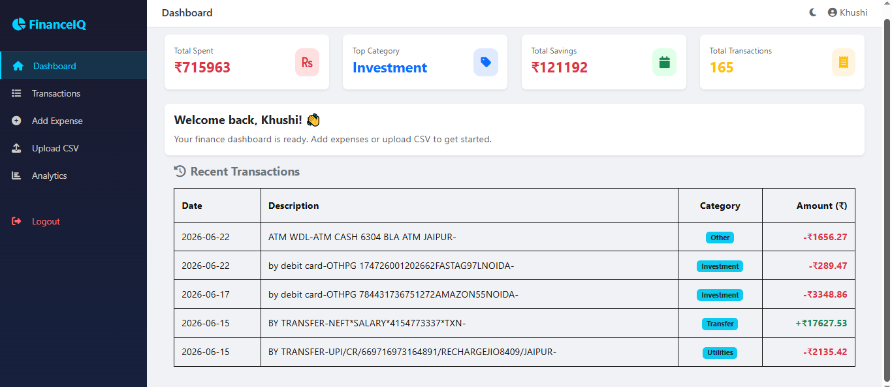
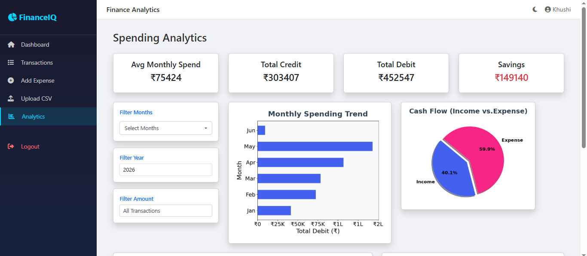
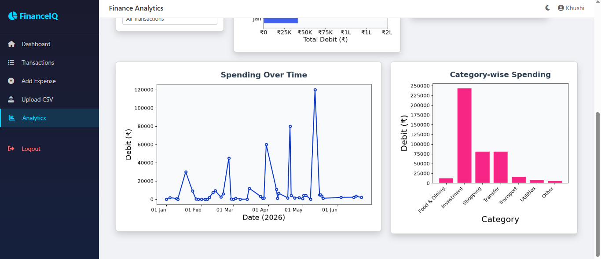
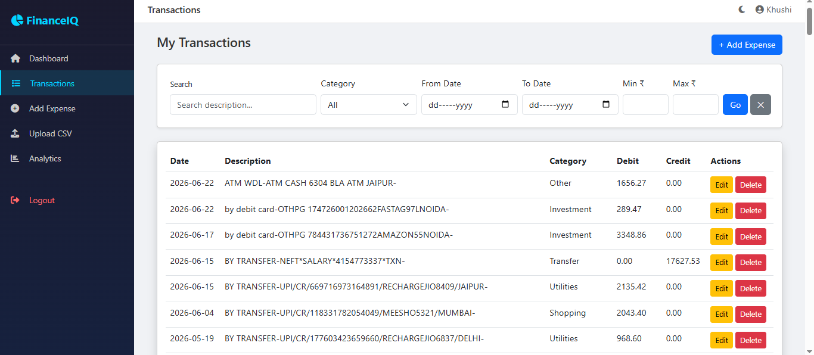
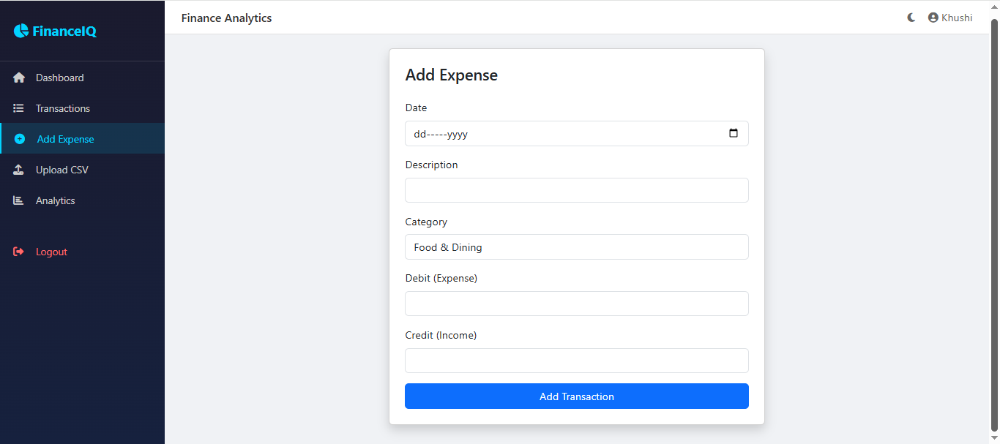
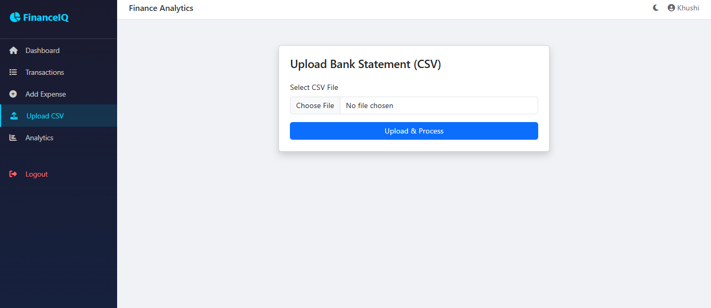

# FinanceIQ 💰

### Personal Finance & Expense Analytics Platform

FinanceIQ is a full-stack web application that helps users track, categorize, and visualize their personal finances. Upload a bank statement, get automatic transaction categorization, and explore your spending patterns through an interactive analytics dashboard.

---

## ✨ Features

- **🔐 User Authentication** — Secure login and registration system to keep your financial data private.
- **📤 CSV Upload & Auto-Categorization** — Upload your bank statement as a CSV file, and transactions are automatically classified into 9 categories (Food & Dining, Transport, Shopping, Utilities, Entertainment, Healthcare, Investment, Transfer, Other) using a keyword-based classifier.
- **📊 Dashboard with KPIs** — At-a-glance view of Total Spent, Top Category, Total Savings, and Total Transactions, along with a Recent Transactions widget.
- **➕ Add Expense** — Manually add individual transactions/expenses through a simple form.
- **📋 Transactions Management** — Search and filter through all your transactions easily.
- **📈 Analytics Dashboard** — Four interactive charts to understand your spending:
  - Monthly Spending Trend
  - Cash Flow (Income vs. Expense)
  - Spending Over Time
  - Category-wise Spending
- **🎛️ Advanced Filters** — Filter analytics by Month, Year, and Amount, with smart fallback warnings when no data matches the selected filter.
- **🌙 Dark Mode** — Toggle between light and dark themes.
- **📱 Responsive UI** — Clean, modern interface built with Bootstrap.

---

## 🛠️ Tech Stack

| Layer | Technology |
|---|---|
| Backend | Python, Flask |
| Database | MySQL |
| Data Processing | Pandas |
| Visualization | Matplotlib |
| Frontend | HTML, Bootstrap, Jinja2 |

---

## 📸 Screenshots

### Dashboard


### Analytics Page



### Transactions Page


### Add Expense


### Upload CSV


---

## 🚀 Getting Started

### Prerequisites

- Python 3.10+
- MySQL Server installed and running

### Installation

1. **Clone the repository**
   ```bash
   git clone https://github.com/Khushi-Vijay06/FinanceIQ.git
   cd FinanceIQ
   ```

2. **Create a virtual environment**
   ```bash
   python -m venv venv
   venv\Scripts\activate      # On Windows
   source venv/bin/activate   # On macOS/Linux
   ```

3. **Install dependencies**
   ```bash
   pip install -r requirements.txt
   ```

4. **Set up the database**
   - Create a MySQL database (e.g., `financeiq`)
   - Update your database credentials in a `.env` file in the root directory:
     ```
     SECRET_KEY=your_secret_key
     DB_HOST=localhost
     DB_USER=your_mysql_username
     DB_PASSWORD=your_mysql_password
     DB_NAME=financeiq
     ```

5. **Run the application**
   ```bash
   python run.py
   ```

6. Open your browser and go to `http://127.0.0.1:5000`

---

## 📁 Project Structure

```
FinanceIQ/
├── app/
│   ├── auth/          # Authentication (login, register)
│   ├── dashboard/      # Dashboard, transactions, analytics routes
│   ├── utils/          # Helper functions (categorization logic, etc.)
│   └── static/         # CSS, JS files
├── templates/          # HTML templates
├── requirements.txt
├── run.py
└── README.md
```

---

## 👩‍💻 Author

**Khushi Vijay**
GitHub: [@Khushi-Vijay06](https://github.com/Khushi-Vijay06)

---

## 📄 License

This project is open source and available for learning purposes.
